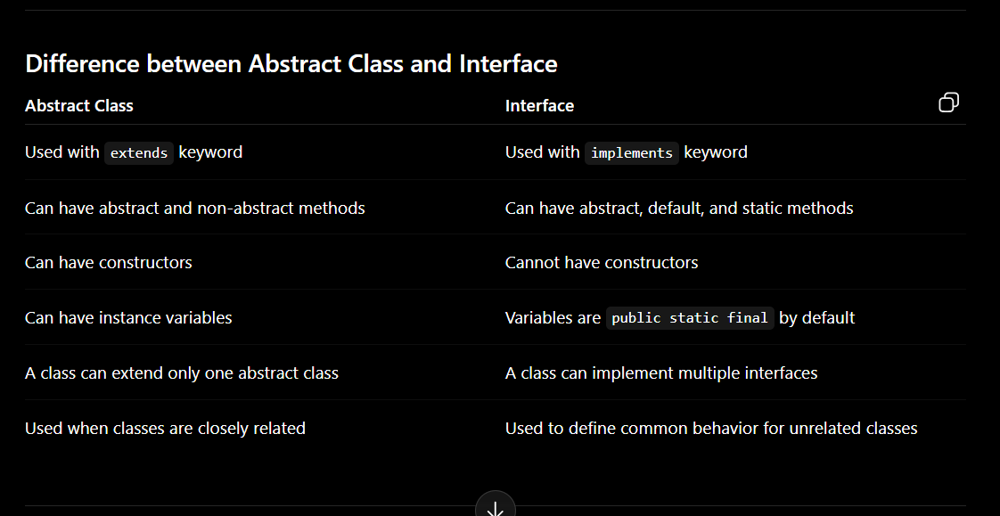

Oops:-
is a methodology or paradigm to design a program using classes and objects.
it simplifies the s/w development and maintenance by providing the some concepts like class, object, polymorphism, encapsulation, inheritence and abstractions.

class:-  
is a user-defined data type which defines it's properties and its functions. class is only logical representation of the data.

Car is a class. The body parts of the car are its properties, and the actions performed by the car are known as functions. the class does not occupy any memory space till the time an object is instantiated.

object:-
is a run-time entity. it is an instance of the class. An object can reprsent a person, car or any other item. An can operate on both data members and member functions.

4 building blocks of oops are:-

1. Polymorphism
2. Inheritence
3. Encapsulation
4. Abstraction

5. Polymorphism:-
   is the ability to present the same interface for differing underlying forms(data types). With polymorphism, each of these classes will have different underlying data. Precisely, Poly means many and morphism means forms.

Types of polysmorphism:- 1. Compile Time Polymorphism 2. Run Time Polymorphism

    1. Compile Time Polymorphism:- The Polymorphism which is implemented at the compile time is known as compile time polymorphism. Ex:- Method Overloading

    Method Overloading:- is a technique to which allows you to have more than one function with the same name but with different functionality. Method Overloading can be possible on the following basis:

         1. The type of parameters passed to the function.
         2. The number of parameters passed to the function.

        Ex:-  class Utility {

            public String add(String a, String b){
                return a+b;
            }

            public int add(int a, int b){
                return a+b;
            }

            public double add(double a, double b){
                return a+b;
            }

            public int add(int a, int b, int c){
                return a+b+c;
            }
        }

    2. Run time polymorphism:-
    is also known as dynamic polymorphism. Method OverRiding is the example of Run Time Polymorphism.
    Overriding means when the child class contains the method whichis is already present in parent class. Hence, the child class overrides the method of the parent class. In case of method overriding, parent and child classes both contain the same method with a different definition. The call to the method is determined at runtime is known as runtime polymorphism.

    class Car {
        void move(){
            sout("Faster");
        }
    }

    class SedanCar extends Car {
        void move(){
            sout("Quicker");
        }
    }

2. Inheritence:-
   is a process in which one object acquires all the properties and behavior of its parent object automatically. In such a way, you reuse, extend or modify the attributes and behaviors which is defined in other classes.

In java, the class which inherits the members of another class is called derived class and the class whose members are inherited is called base class.

The derived class is the specialized class for the base class.

    Types of Inheritence:-
    1. Single level
    2. Multi level
    3. Hierarchical
    4. Hybrid :- single, multiple, Hierarchical etc....
    5. Multiple

3.  Encapsulation:-
    Encapsulation is an OOP concept where data and methods are wrapped together inside a class, and direct access to data is restricted.
    is the process of binding data and methods together in a single unit and restricting the direct access to the data.
    In java, we achieve encapsulation by declaring variable as private and providing public getter and setter methods to access and modify them.

                class Student {
                private String name;
                private int age;

                    public String getName() {
                        return name;
                    }

                    public void setName(String name) {
                        this.name = name;
                    }

                    public int getAge() {
                        return age;
                    }

                    public void setAge(int age) {
                        if (age > 0) {
                            this.age = age;
                        }
                    }

                }

                public class Main {
                public static void main(String[] args) {
                    Student s = new Student();

                    s.setName("Rahul");
                    s.setAge(22);

                    System.out.println(s.getName());
                    System.out.println(s.getAge());
                }

            }

        Protect data from direct access.
        Improve security by using private variables.
        Control data changes through setters.
        Make code easier to maintain

        <!--  -->

    4. Abstraction:-
       Abstraction is an OOP concept where we show only the important details to the user and hide the internal implementation.

Abstraction is the process of hiding implementation details and showing only essential features to the user. In Java, abstraction is achieved using abstract classes and interfaces.

what an object does is shown, but how it does it is hidden.

Real-life example
When you drive a car, you use the steering, brake, and accelerator. You do not need to know exactly how the engine works internally. That is abstraction.

        

    Abstract Class
    An abstract class is a class that cannot be directly instantiated. It can have both:
        Abstract methods
        Concrete methods
        Variables
        Constructors

    Interface
    An interface is a blueprint of a class. It is mainly used to achieve abstraction and multiple inheritance in Java.
    An interface can contain:
        Abstract methods
        Default methods
        Static methods
        Constants

An abstract class is used when we want to provide both common implementation and abstraction. An interface is used when we want to define a contract that multiple classes can follow. A class can extend only one abstract class, but it can implement multiple interfaces.
